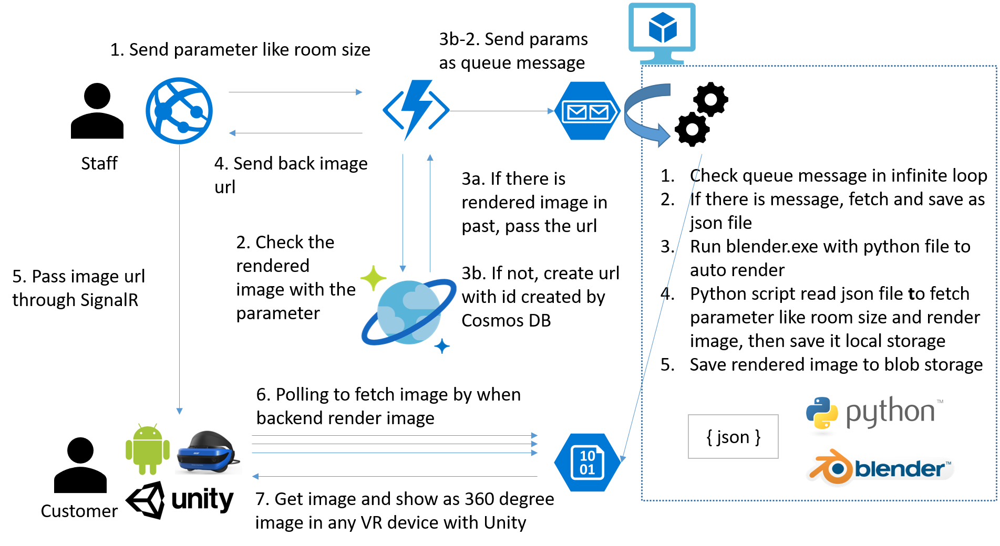

# Virtual Reality Showroom with Cloud Rendering 
We develops room simulation app for EC, Retail and Real estate companies. This is open source and you can utilize it.

# Background and motivation
When customer try to buy furniture (ex. TV and Sofa), it’s hard to imagine whether it is fit for own room. It affect withdrawal rate and can lost customer in EC and Retail store. 

When we move to other house, it’s hard to image whether existing furniture fits and can’t decide to save all or through away some of them and buy new one. We also can’t imagine largeer room and merit correctly and tend to find cheaper room.

# Solution
We made VR showroom solution for letting customer image existing furniture correctly and richer life style. With this solution customers can confirm whether new furniture fit in the room. In addition to it, customer can imagine bigger room and more furniture can change their life style more comfortable.

Our scope is we can easily put furniture and change room property. For reaching this goal, we made web client for sales staff, Unity client for customer and backend for rendering panorama image. With web client, staff can easily change room properties (ex. room size) and it will sent it as task to backend. In backend, we handle each task and starts rendering. Finally customer can see rendered image correctly.

## Architecture


## Solution structure
This is map for you to understand sample solution.

|Role|Project Name|
|----|------------|
|Web application for staff|HomePreview/HomePreview.Web|
|Unity client for customer|HomePreview/HomePreview.Unity|
|Check existing image and send task rendering|HomePreview/RenderTaskHandelerFunction|
|Render task worker|HomePreview/RenderTaskHandlerVM|
|Render script for automation|Blender/homepreview.blend|

* homepreview.blend is sandbox for playing around python script. It includes python script.

## How to run
You need to make `local.settings.json` like this for running Azure Functions.

```javascript
{
  "IsEncrypted": false,
  "Values": {
    "AzureWebJobsStorage": "UseDevelopmentStorage=true",
    "AzureWebJobsDashboard": "UseDevelopmentStorage=true",
    "CosmosDBConnectionString": "<Your Cosmos DB Connection String>",
    "CosmosDBServiceUrl": "https://<your url>.documents.azure.com:443/",
    "CosmosDBKey": "<Your Cosmos DB Key>",
    "StorageUrl": "https://<your storage url>.blob.core.windows.net",
    "StorageContainerName": "public"
  }
}
```

## Data scheme

### Request to Azure Functions

HTTP POST `http://localhost:7071/api/PostRenderTask`
(You must update url with your environment)

BODY
```javascript
{
    "roomsize":12,
    "windowsize":5
}
```

### Response
You will get following reesponse from Azure Functions. It also send same data to Storage queue as Queue message
```javascript
{
    "id": "5866bda9-2006-45c5-812e-ec3b692a5848",
    "roomsize": 12,
    "windowsize": 5,
    "imageUrl": "https://<Your storage url>/public/5866bda9-2006-45c5-812e-ec3b692a5848.png"
}
```
- When there is existing object in Cosmos DB, return `200 OK` with data
- When there is no object (that is, this is new parameter), return `201 Created` with data 


# Team
- Ken Nagao (Lead Programa Manager)
- Xinyu Liu (PM)
- Madoka Chiyoda (Lead Software Engineer)
- [Masayuki Ota (SE)](https://twitter.com/masota0517)

